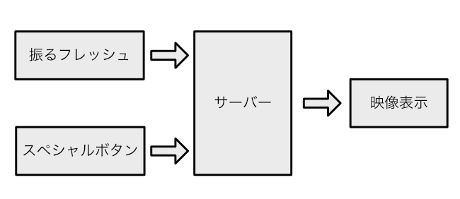

class: center, middle

# 入社式を支えるサーバー

森國 泰平 (@morikuni)

---

## なにをしたか

振るフレッシュ & スペシャルボタンから発行されたイベントを映像表示に渡す

.center[

]

---

## つくったもの

Nginx + Goでイベントのpub-subサーバーを作った

- `/publish` (WebSocket) − 振るフレッシュ
- `/publish_rest` (HTTP) − スペシャルボタン
- `/subscribe` (WebSocket) − 映像表示

`publish`にやってきたデータを`subscribe`している全てのクライアントにブロードキャストする

---

## データフォーマット

.half-left[
```json
# publish
{
	"strength": 0 ~ 100,
}
```

### `strength`

- 振った強さ
- 誰のボタンか(1,2,3)
]

.half-right[
```json
# subscribe
{
	"type": 1 ~ 3,
	"strength": 0 ~ 100,
}
```

### `type`

- 1: 振るフレッシュ
- 2: ボタン
- 3: 不正アクセス
]

---

## Nginxの設定

```nginx
location / {
	proxy_pass http://127.0.0.1:8080;
	proxy_http_version 1.1;
	proxy_set_header Upgrade $http_upgrade;
	proxy_set_header Connection "upgrade";
	proxy_read_timeout 86400;
}
```

WebSocketを使うためには`proxy_set_header Upgrade $http_upgrade;`と`proxy_set_header Connection "upgrade";`が必要

デフォルトでは60秒間通信がないと接続が切れるらしいので`proxy_read_timeout 86400;`

---

## 不正検出

「攻撃してくる人がいるから気をつけて」的なことを聞いたのでちょっとだけ対策した

以下の場合に`subscribe`に不正アクセスがあったというイベントを送信する

- `strength`が範囲外の値になっている
- 振るフレッシュから1秒間に5回以上送信されている

何度か不正アクセスと判断されたが、ネットワークの遅延が原因？
