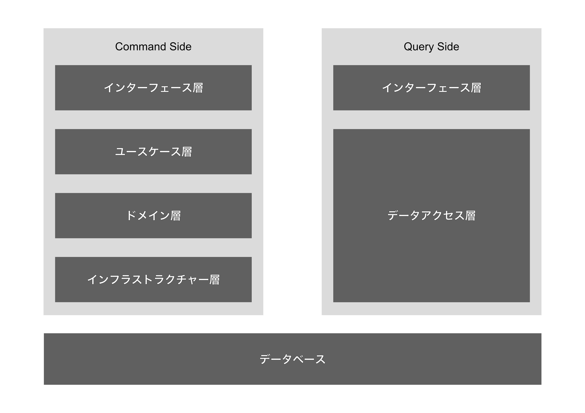
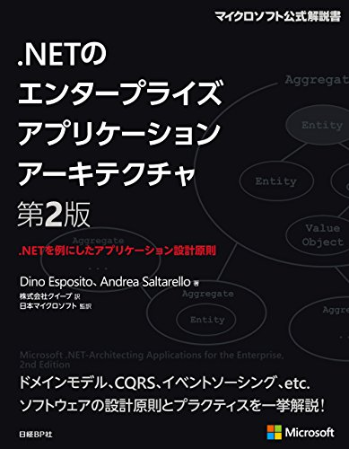
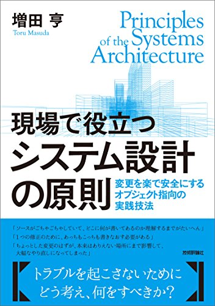

theme: Plain Jane, 3
autoscale: true

# [fit] DDD(ドメイン駆動設計)入門
# @morikuni

---

# DDDとは

---

# モデル駆動設計 +
# エクストリームプログラミング + α

- コードではなく前にモデルを設計する
- モデルとコードを一致させる
- 継続的にモデル(とコード)を見直す
- チーム内で使う言葉を統一する(ユビキタス言語)

---

# モデルとは

---

> モデルとは、プロジェクトに携わる人々の頭の中で構築された概念の集まりである
-- エリック・エヴァンスのドメイン駆動設計

---

> 問題を解決する上で関連する側面を抽象化し、それ以外の詳細を無視することによって行われた、現実に対する1つの解釈なのだ。
-- エリック・エヴァンスのドメイン駆動設計

---

# モデルとは

- ドメイン上に現れる概念である
- チーム内の全員の共通の認識であり、ユビキタス言語を支える
- コードにもモデルがそのまま現れる
- モデルが変わればコードも変わり、コードが変わればモデルも変わる

---

# DDDが目指すもの

---

# DDDが目指すもの

## ビジネスの進化を支える

- 技術者がデータの出し入れを意識した実装を行うと、モデルと実装が乖離する
- モデルの修正による影響範囲の調査に時間がかかるようになり、ビジネスの変化にコードの変化が追いつけなくなる
- モデルと実装が一致していれば、モデルの修正と影響調査は1つのプロセスになる

---

# DDDが目指すもの

## ドメインへの理解を深める

- モデルを構築するためにはビジネスについて理解しなければならない
- モデルには技術的制約も反映されなくてはならないため、技術とビジネスとの妥協点について深く考察する必要がある
- 考察と修正を繰り返すことで最終的にドメインの知識を正確に反映したモデルが手に入る

---

# DDDが目指すもの

## コミュニケーションを円滑にする

- モデルは企画者から技術者(とコード)まで全ての人に共有され、ユビキタス言語(あたりまえに使われる言葉)となる
- ユビキタス言語により、使われる言葉をデータベース上のデーブルなどに翻訳することなく会話ができるようになる
- もしユビキタス言語が不自然に感じるのであれば、モデルが正確ではない可能性がある

---

# どうやってDDDで実装するのか？

---

# DDDの戦術的要素

- ドメインの隔離 (レイヤードアーキテクチャ)
- モデルの表現 (エンティティ, バリューオブジェクト, サービス, 仕様)
- ライフサイクルの管理 (集約, リポジトリ, ファクトリ)
- サポートアーキテクチャ (ドメインイベント, CQRS, Event Sourcing)

---

# ドメインの隔離

---

# ドメインの隔離

- ソフトウェアを責務の単位でいくつかの層に分離し、各層の依存を1方向に限定する
- ドメインロジックがUIやデータベースなどの技術的要素によって複雑化することを避ける

---

### レイヤードアーキテクチャ

|レイヤー|責務|
| :--- | :--- |
|インターフェース層|ユーザーや外部のシステムに機能(ユースケース)を提供する。APIやスクリプトなど、外部との接点1つにつき1つのインターフェースが用意される。|
|ユースケース層|インターフェース層からのリクエストを解釈し、ドメイン層に処理を委譲する。機能1つにつき1つのユースケースが用意される。|
|ドメイン層|ドメインの状態を反映し、ドメインロジックを実行する。|
|インフラストラクチャー層|データベースやメッセージングなど、技術的な課題を解決する。|

---

# ドメインの隔離

## レイヤードアーキテクチャの仲間

- レイヤードアーキテクチャ(紹介したもの)
    - インフラ層を一番上に持ってくるパターンもある(DIP)
- ヘキサゴナルアーキテクチャ
- オニオンアーキテクチャ
- クリーンアーキテクチャ

---

# 🚔👮
# レイヤードアーキテクチャを採用したからといってDDDではない

---

# モデルの表現

---

# モデルの表現

ドメインモデルは次のいずれかに分類できる。

- エンティティ
- バリューオブジェクト
- (仕様)
- サービス

同じ言葉で表されるモデルでも、ドメインによって別の表現になる。

---

# モデルの表現

## エンティティ

- 別名 参照オブジェクト
- 識別子によって同一性が定義されるもの
- 識別子、エンティティ、バリューオブジェクトで構成される
- `FindByXXX` で1件に絞れるものはほとんどがエンティティ
- 例: User, Account, Ticket

---

```go
type UserID int

type User struct {
    ID       UserID
    Profile  Profile
    PersonID PersonID
}

// 複数のフィールドから識別子が構成されることもある
type TicketID struct {
    EventID      EventID
    SerialNumber SerialNumber
}

type Ticket struct {
    ID     TicketID
    UserID UserID
}
```

---

# モデルの表現

## バリューオブジェクト

- 属性によって同一性が定義されるもの
- プリミティブ値(int, string...)、エンティティの識別子、バリューオブジェクトで構成される
- **全ての属性の組み合わせ**によって初めてUNIQUEになれる
- いくつかの属性でUNIQUEになれるならエンティティかもしれない
- 例: Profile, Money, Location

---

```go
type Name string

type Profile struct {
    Name        Name   // NameはN文字制限があるので別のバリューオブジェクトにする
    Description string // Descriptionは制限がないのでstringでいい
    Icon        URL
}

type Location struct {
    Latitude  Latitude
    Longitude Longitude
}

func (a Location) DistanceTo(b Location) Distance {
    // geometricは地球上の2地点間の距離を計算してくれる仮想のライブラリ
    return Distance(geometric.Distance(a.Latitude, a.Longitude, b.Latitude, b.Longitude))
}

type Distance uint
```

---

# モデルの表現

## 仕様

- 特定のモデルに対する仕様を表すオブジェクト
- バリューオブジェクトの一種として表現されるが、モデルの検証、選択、生成をする処理が主役
- ValidateやIsSatisfiedといったメソッドを持つ
- 例: 予算や日程から宿泊プランの検証

---

```go
type StayPlanSpecification struct {
    Budget   Money
    Schedule Period
}

// 宿泊プランが仕様を満たしているか検証する
func (spec StayPlanSpecification) Validate(plan StayPlan) error {
    if plan.Charge().IsOver(spec.Budget) {
        return ChageOverBudgetError()
    }
    if !plan.HasAnyEmptyRoomIn(spec.Schedule) {
        return ThereIsNoEmptyRoomError()
    }
    return nil
}

type StayPlanList []StayPlan

// 仕様から宿泊プランを選択する
func (list StayPlanList) Select(spec StayPlanSpecification) StayPlanList {
    result := StayPlanList{}
    for _, plan := range list {
        if spec.Validate(plan) == nil {
            result = append(result, plan)
        }
    }
    return result
}
```

---

```go
type NameSpecification struct {
    MinLength uint
    MaxLength uint
    NgWords   []string
}

func (spec NameSpecification) Validate(name Name) error {
    if len(name) > spec.MaxLength {
        return NameTooLongError()
    }
    if len(name) < spec.MinLength {
        return NameTooShortError()
    }
    for _, ng := range spec.NgWords {
        if strings.Contains(name, ng) {
            return NameContainsNgWordError()
        }
    }
    return nil
}

# 仕様からNameを生成する
func GenerateRandomName(spec NameSpecification) Name {
    for {
        name := Name(rand.String()) // rand.String()はランダムな文字列を生成してくれる仮想の関数
        if spec.Validate(name) == nil {
            return name
        }
    }
}
```

---

# モデルの表現

## サービス

- 属性や識別子を持たない、ただの処理
- エンティティやバリューオブジェクトに割り当てるには不自然な処理を行う
- 動詞にちなんだ名前がつけられる
- 手続き型のコードになっていくため多用すべきではない
- 例: MoneyTransferService (not AccountService)

---

```go
// 送金元が送金先の口座を操作するのは不自然なのでサービスにする
type MoneyTransferService struct{}

func (s MoneyTransferService) Transfer(from, to Account, money Money) {
    from.Withdraw(money)
    to.Deposit(money)
}
```

---

# ライフサイクルの管理

---

# ライフサイクルの管理

- オブジェクトは生成されたあと、永続化され、削除される
- その間に他のオブジェクトと関わり合うことになるが、モデルとしての整合性は保たれ続けなければならない
- オブジェクトのライフサイクルを通してどのように整合性を保ち続けるかが問題となる

---

# ライフサイクルの管理

## 集約

- 強整合性(トランザクション整合性)の単位
- 1つのルートエンティティと複数のエンティティ、バリューオブジェクトで構成される
- ルートエンティティが削除されたら、内部のモデルも削除される
- 外部から参照されるのはルートエンティティのみ
- 例: Group(Group, GroupMember), Order(Order, OderItem)

---

```go
type Group struct {
    ID              GroupID
    MemberCount     uint
    GroupMemberList GroupMemberList
}

func (g *Group) AddMember(user User) {
    g.GroupMemberList.Add(g.CreateGrouopMember(user))
}

func (g *Group) CreateGrouopMember(user User) {
    // MemberCountとGroupMemberList内の数が常に一致するようにする
    g.MemberCount++
    return GroupMember{
        ID: GroupMemberID{
            GroupID: g.ID,
            ID:      g.MemberCount,
        },
        UserID: user.ID,
    }
}

# GroupMemberIDはGroup内でユニークな識別子
type GroupMemberID struct {
    GroupID GroupID
    ID      uint
}

type GroupMember struct {
    ID     GroupMemberID
    UserID UserID
}
```

---

# ライフサイクルの管理

## リポジトリ

- モデルの永続化、検索を抽象化する
- 集約1つにつきリポジトリを1つ用意する
- 特定の永続化技術に依存しすぎるべきではないが、制約は受け入れなくてはならない
- 例: UserRepository(Redis), OrderRepository(MySQL)

---

```go
type UserRepository struct {
    redis redis.Client
}

// Redisを使っているのでID検索以外の検索機能は使えない
func (repo UserRepository) FindByID(id UserID) User {
    data := repo.redis.Get(id)

    user := User{}
    json.Unmarshal(data, &user)

    return user
}
```

---

# ライフサイクルの管理

## ファクトリ

- 複雑かつ詳細を隠蔽したいオブジェクトを生成する
- 基本的にはコンストラクタを使えばいいため、多様すべきではない
- 集約にファクトリメソッドを定義することで、関連のあるオブジェクトを生成させることもできる

---

# サポートアーキテクチャ

- DDDを実践するときに有効な道具とアーキテクチャ
    - ドメインイベント
    - CQRS (コマンドクエリ責務分離)
    - Event Sourcing

---

# サポートアーキテクチャ

## ドメインイベント

- ドメインで発生した**過去の事実**を表す
- 非同期処理(結果整合性)を行うための道具
- Pub/Subによってイベントを伝播させる
- XXXをしたときにYYYをするという要件において、XXXが実行された時にドメインイベントを発行し、非同期でYYYを実行する
- 集約間の整合性の維持や別サービスへの通知として利用できる
- 例: ユーザーが登録されたらWelcomeメールを送信してください

---

```go
// この関数はHTTP経由で実行されるものとする
func RegisterUser(name, email string) {
    user, event := NewUser(NewName(name), NewEmail(email))
    repository.Save(user)
    pubsub.Publish(event)
}

func NewUser(name Name, mail Email) (User, Event) {
    user := User{ ID: rand.Int(), Name: name, Email: mail }
    event := UserCreated{ ID: user.ID, Name: user.Name, Email: mail }
    return user, event
}

// 以下は別のプロセスとする
func HandleUserCreated(event UserCreated) {
    mailer.SendWelcomeMail(event.Email, event.Name)
}

func main() {
   pubsub.Subscribe("user_created", HandleUserCreated)
}
```

---

# サポートアーキテクチャ

## CQRS (コマンドクエリ責務分離)

- 一般的なアプリケーションは1つのモデルがデータの更新とデータの読み込みの責務を持っている
- CQRSではコマンド(更新処理)とクエリ(読込処理)の実装を分離する
- モデル(コマンド側)が単純化できる
    - Getterが減る(のでロジックを閉じ込めやすい)
- クエリに特化した実装ができる
    - 読込でデータが壊れることはないので、モデルなどを経由せずに効率的なデータベースアクセスが可能
- コマンド側とクエリ側のデータベースを分けることも出来る
    - この場合はドメインイベントによってデータベースを同期する(結果整合性)

---



---

# サポートアーキテクチャ

## Event Sourcing

- 一般的なアプリケーションは現在の状態をデータベースに保存する
- Event Sourcingでは一連のドメインイベントを保存し、読み込み時にはイベントから状態を復元する
- CQRSと組み合わせて使われることが多い(現在の状態がないのでJOINなどができないので読み込み用のDBを使う)
- 過去の任意の時点における状態を再現できる(過去のデータから仮説検証などが可能)
- ドメインイベントの保存とPublishをAtomicに実行可能(保存したものをPublishできる仕組みがあれば)

---

|Action|State Sourcing|Event Sourcing|
|:---|:---|:---|
|1.ユーザー登録  |`User{ID:123, Name:"tarou", Like: 0}` |`UserRegistered{UesrID:123, Name:"tarou"}`  |
|2.いいねされた  |`User{ID:123, Name:"tarou", Like: 1}` |`UserGotLike{UserID:123}`                   |
|3.ユーザー名変更|`User{ID:123, Name:"hanako", Like: 1}`|`UserNameUpdated{UserID:123, Name:"hanako"}`|
|4.ユーザー削除  |`nil`                                 |`UserDeleted{UserID:123}`                   |

---

# まとめ

---

# まとめ

- DDDはドメインの理解とビジネスの成長を支える
- モデルとコードを一致させれば開発を加速できる
- 継続的にモデルを見直し、新しい概念を見つけ出そう
- いくつかの戦術があるので、自分たちが使えるものだけ取り入れればいい

---

# おすすめの本

---


## エリックエヴァンスのドメイン駆動設計
####[https://www.amazon.co.jp/dp/B00GRKD6XU](https://www.amazon.co.jp/dp/B00GRKD6XU)


---


## 実践ドメイン駆動設計
####[https://www.amazon.co.jp/実践ドメイン駆動設計-ヴァーン-ヴァーノン-ebook/dp/B00UX9VJGW](https://www.amazon.co.jp/%E5%AE%9F%E8%B7%B5%E3%83%89%E3%83%A1%E3%82%A4%E3%83%B3%E9%A7%86%E5%8B%95%E8%A8%AD%E8%A8%88-%E3%83%B4%E3%82%A1%E3%83%BC%E3%83%B3-%E3%83%B4%E3%82%A1%E3%83%BC%E3%83%8E%E3%83%B3-ebook/dp/B00UX9VJGW)

---




## .NETのエンタープライズアプリケーションアーキテクチャ
####[https://www.amazon.co.jp/NETのエンタープライズアプリケーションアーキテクチャ第2版-NETを例にしたアプリケーション設計原則-ディノ-エスポシト-ebook/dp/B00ZQZ8JNE](https://www.amazon.co.jp/NET%E3%81%AE%E3%82%A8%E3%83%B3%E3%82%BF%E3%83%BC%E3%83%97%E3%83%A9%E3%82%A4%E3%82%BA%E3%82%A2%E3%83%97%E3%83%AA%E3%82%B1%E3%83%BC%E3%82%B7%E3%83%A7%E3%83%B3%E3%82%A2%E3%83%BC%E3%82%AD%E3%83%86%E3%82%AF%E3%83%81%E3%83%A3%E7%AC%AC2%E7%89%88-NET%E3%82%92%E4%BE%8B%E3%81%AB%E3%81%97%E3%81%9F%E3%82%A2%E3%83%97%E3%83%AA%E3%82%B1%E3%83%BC%E3%82%B7%E3%83%A7%E3%83%B3%E8%A8%AD%E8%A8%88%E5%8E%9F%E5%89%87-%E3%83%87%E3%82%A3%E3%83%8E-%E3%82%A8%E3%82%B9%E3%83%9D%E3%82%B7%E3%83%88-ebook/dp/B00ZQZ8JNE)

---



## 現場で役立つシステム設計の原則 〜変更を楽で安全にするオブジェクト指向の実践技法
####[https://www.amazon.co.jp/dp/B073GSDBGT](https://www.amazon.co.jp/実践ドメイン駆動設計-ヴァーン-ヴァーノン-ebook/dp/B00UX9VJGW)

