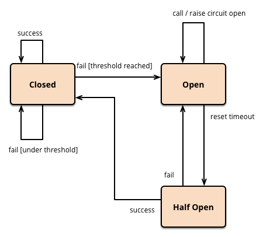

theme: Plain Jane, 3
autoscale: true

# [fit]強いサービスの作り方
# @morikuni

---

# 強いサービスとは

---

# リアクティブ宣言

>求められているのは、システムアーキテクチャに対する明快なアプローチであると我々は考える。そして、必要な側面の全ては既に独立に認識されている: 求めるものは、即応性と、耐障害性と、弾力性と、メッセージ駆動とを備えたシステムだ。我々はこれをリアクティブシステム (Reactive Systems) と呼ぶ。
-- [http://www.reactivemanifesto.org/ja](http://www.reactivemanifesto.org/ja)

---

## リアクティブシステムとは

- 即応性 (Responsive)
    - システムは可能な限りすみやかに応答する。
- 耐障害性 (Resilient)
    - システムは障害に直面しても即応性を保ち続ける。
- 弾力性 (Elastic)
    - システムはワークロードが変動しても即応性を保ち続ける。
- メッセージ駆動 (Message Driven)
    - リアクティブシステムは非同期なメッセージパッシングに依ってコンポーネント間の境界を確立する。

---

# 本日はアプリケーションレベルの
# 耐障害性についてお話しします

---

# 耐障害性のあるサービス

- 死なない
- 外部リソースが死んでいても重くならない
- (外部リソースを殺さない)

---

# 耐障害性を持たせるためのパターン

- Timeout
- Retry
- Rate Limit
- Bulkhead
- Circuit Breaker
- and more...

---

# Timeout

|||
|:-:|:-:|
|障害|高負荷などにより処理が低速になる|
|障害の影響|低速な処理を行うサービスが低速になる。そのサービスにアクセスするサービスが低速になる。そのサービス…|
|対策|時間がかかる可能性のある処理に制限時間を設ける|
|うれしいところ|低速な外部リソースの影響を受けない|
|Goでの実装|`context.WithTimeout`, `context.WithDeadline`|
|||

---

# Timeout

```go
ctx, cancel := context.WithTimeout(ctx, time.Second)
defer cancel()

select {
case <-ctx.Done():
    return ctx.Err()
case result := <-Process(ctx):
    return result
}
```

---

# Retry

|||
|:-:|:-:|
|障害|ネットワークが切断される。外部リソースのプロセスが再起動する。etc...|
|障害の影響|処理が失敗する|
|対策|処理が失敗した場合に適切か間隔をあけて再試行する|
|うれしいところ|一時的な障害から自動で回復する|
|Goでの実装|`github.com/Songmu/retry`|
|||

---

# Retry

```go
err := retry.Retry(3, time.Second, func() error {
    return Process()
})

func Retry(n uint, interval time.Duration, fn func() error) (err error) {
	for n > 0 {
		n--
		err = fn()
		if err == nil || n <= 0 {
			break
		}
		time.Sleep(interval)
	}
	return err
}
```

---

# Rate Limit

|||
|:-:|:-:|
|障害|想定以上に処理が実行され高負荷になる|
|障害の影響|処理が失敗する。低速になる。etc...|
|対策|特定の期間に処理が実行できる回数を制限する|
|うれしいところ|負荷を制御することが出来る|
|Goでの実装|`golang.org/x/time/rate`|
|||

---

# Rate Limit

```go
limiter := rate.NewLimiter(rate.Every(time.Second/1000), 5000)
err := limiter.Wait(ctx)
if err != nil {
    return err
}
Process()
```

---

# Bulkhead

|||
|:-:|:-:|
|障害|一部の処理がCPUを使いすぎる|
|障害の影響|サービス全体が高負荷になる|
|対策|各処理が使える計算リソースを分離する|
|うれしいところ|負荷を制御することが出来る|
|Goでの実装|`https://github.com/Jeffail/tunny` goroutineのスケジューラーは触れないので厳密に分離はできない|
|||

---


[https://skife.org/architecture/fault-tolerance/2009/12/31/bulkheads.html](https://skife.org/architecture/fault-tolerance/2009/12/31/bulkheads.html)


---

# Bulkhead

```go
pool, _ := tunny.CreatePool(10, func(object interface{}) interface{} {
    return Process(object.(string))
}).Open()

defer pool.Close()

result, err := pool.SendWork("hello")
```

---

# Circuit Breaker

|||
|:-:|:-:|
|障害|外部リソースが高負荷になり処理に失敗する|
|障害の影響|高負荷なところにアクセスを続けるので負荷が下がらない|
|対策|外部リソースの障害を検知したら以降はアクセスしない|
|うれしいところ|外部リソースが復旧できる可能性が上がる。無駄なアクセスを減らせるので高速になる。|
|Goでの実装|`https://github.com/rubyist/circuitbreaker`|
|||

---




[https://martinfowler.com/bliki/CircuitBreaker.html](https://martinfowler.com/bliki/CircuitBreaker.html)

---

# Circuit Breaker

```go
cb := circuit.NewThresholdBreaker(10)
err := cb.Call(func() error {
    return Process()
}, timeout * time.Second)
```

---

# たくさんあって難しいなあ😇

---

# なので作りました
# [`github.com/morikuni/guard`](https://github.com/morikuni/guard)

---

# はじめまして。
# 私はgithub.com/morikuni/guard。
# あなたのサービスを守ります。


---

# [`github.com/morikuni/guard`](https://github.com/morikuni/guard)

`context.Context`を使い、`error`を返す処理を実行するための`interface`。

```go
// Guard is a process manager that runs and manages the process.
type Guard interface {
	// Run runs the function with its own capability.
	Run(ctx context.Context, f func(context.Context) error) error
}
```

`Guard`の実体はサブディレクトに分かれている。

---

- `github.com/morikuni/guard`
    - `github.com/morikuni/guard/panicguard`
    - `github.com/morikuni/guard/retry`
    - `github.com/morikuni/guard/ratelimit`
    - `github.com/morikuni/guard/semaphore`
    - `github.com/morikuni/guard/circuitbreaker`

---

# `github.com/morikuni/guard/panicguard`

`panic`を封じ込めて`error`(`PanicOccured`型)に変換する

```go
guard := panicguard.New()
err := guard.Run(context.Background(), func(ctx context.Context) error {
    panic("aaa")
})
fmt.Printf("%#v\n", err)

// panicguard.PanicOccured{Reason:"aaa"}
```

---

# `github.com/morikuni/guard/retry`

`error`が返るとバックオフの設定に従いリトライする

```go
guard := retry.New(3, guard.NewConstantBackoff(time.Second))
err := guard.Run(context.Background(), func(ctx context.Context) error {
    fmt.Println(time.Now().Format("2006-01-02 15:04:05"), "hello")
    return errors.New("error")
})
fmt.Println(time.Now().Format("2006-01-02 15:04:05"), err)

// 2017-09-05 15:57:47 hello
// 2017-09-05 15:57:48 hello
// 2017-09-05 15:57:49 hello
// 2017-09-05 15:57:50 hello
// 2017-09-05 15:57:50 error
```

---

# `github.com/morikuni/guard/ratelimit`

一定期間内に実行可能な処理の数を制限する

```go
limiter := rate.NewLimiter(rate.Every(time.Second/2), 1)
guard := ratelimit.New(limiter)
wg := sync.WaitGroup{}
for i := 0; i < 10; i++ {
    wg.Add(1)
    go func() {
        guard.Run(context.Background(), func(ctx context.Context) error {
            fmt.Println(time.Now().Format("2006-01-02 15:04:05"), "hello")
            wg.Done()
            return nil
        })
    }()
}
wg.Wait()
```

---

# `github.com/morikuni/guard/ratelimit`

```go
// 2017-09-05 16:03:22 hello
// 2017-09-05 16:03:22 hello
// 2017-09-05 16:03:23 hello
// 2017-09-05 16:03:23 hello
// 2017-09-05 16:03:24 hello
// 2017-09-05 16:03:24 hello
// 2017-09-05 16:03:25 hello
// 2017-09-05 16:03:25 hello
// 2017-09-05 16:03:26 hello
// 2017-09-05 16:03:26 hello
```

---

# `github.com/morikuni/guard/semaphore`

同時に実行できる処理の数を制限する

```go
guard := semaphore.New(3)
wg := sync.WaitGroup{}
for i := 0; i < 10; i++ {
    wg.Add(1)
    go func() {
        guard.Run(context.Background(), func(ctx context.Context) error {
            fmt.Println(time.Now().Format("2006-01-02 15:04:05"), "hello")
            time.Sleep(time.Second)
            wg.Done()
            return nil
        })
    }()
}
wg.Wait()
```

---

# `github.com/morikuni/guard/semaphore`

```go
// 2017-09-05 16:07:40 hello
// 2017-09-05 16:07:40 hello
// 2017-09-05 16:07:40 hello
// 2017-09-05 16:07:41 hello
// 2017-09-05 16:07:41 hello
// 2017-09-05 16:07:41 hello
// 2017-09-05 16:07:42 hello
// 2017-09-05 16:07:42 hello
// 2017-09-05 16:07:42 hello
// 2017-09-05 16:07:43 hello
```

---

# `github.com/morikuni/guard/circuitbreaker`

エラー率が閾値を超えるとそれ以上処理を実行しない

```go
window := circuitbreaker.NewCountBaseWindow(5)
backoff := guard.NewExponentialBackoff(guard.WithInitialInterval(2 * time.Second))
guard := circuitbreaker.New(window, 0.6, backoff)
for i := 0; i < 10; i++ {
    err := guard.Run(context.Background(), func(ctx context.Context) error {
        fmt.Println(time.Now().Format("2006-01-02 15:04:05"), "hello")
        return errors.New("error")
    })
    fmt.Println("ERROR", err)
    time.Sleep(500 * time.Millisecond)
}
```

---

# `github.com/morikuni/guard/circuitbreaker`

```go
// 2017-09-05 16:15:17 hello
// ERROR error
// 2017-09-05 16:15:17 hello
// ERROR error
// 2017-09-05 16:15:18 hello
// ERROR error
// ERROR circuit breaker open
// ERROR circuit breaker open
// ERROR circuit breaker open
// ERROR circuit breaker open
// 2017-09-05 16:15:20 hello
// ERROR error
// ERROR circuit breaker open
// ERROR circuit breaker open
```

---

# [fit]guardではこれらを好きに合成できます
# [fit]`func Compose(guards ...Guard) Guard`

---

秒間100回までの制限(500回までバースト可)付きで、
3回まで100ミリ秒間隔でリトライし、
直近100回のうちエラー率が0.5を越えるとOpenするExponential Backoffを備えたサーキットブレーカー内蔵で、
同時実行可能数が100までかつ、
`panic`しても死なない、
`Guard`の例

```go
backoff := guard.NewExponentialBackoff(
    guard.WithInitialInterval(50*time.Millisecond),
    guard.WithMaxInterval(2000*time.Millisecond),
    guard.WithMultiplier(2),
    guard.WithRandomizationFactor(0),
)
window := circuitbreaker.NewCountBaseWindow(100)
cb := circuitbreaker.New(window, 0.5, backoff)
guard := guard.Compose(
    ratelimit.New(rate.NewLimiter(rate.Every(time.Second/100), 500)),
    retry.New(3, guard.NewConstantBackoff(100*time.Millisecond)),
    cb,
    semaphore.New(100),
    panicguard.New(),
)
```

---

# 注意点

合成する順番を考えないとハマります。

```go
// リトライするたびに実行権を獲得する(5000兆個でも同時にリトライ待ちが可能)
guard := guard.Compose(
    retry.New(3, guard.NewConstantBackoff(time.Second)),
    semaphore.New(100),
)
```

```go
// 実行権を獲得した後でリトライする(他のリトライ待ちによって実行がブロックされる)
guard := guard.Compose(
    semaphore.New(100),
    retry.New(3, guard.NewConstantBackoff(time.Second)),
)
```

---

# `github.com/morikuni/guard`で強いサービスを作りましょう

---

# To Be Released...
