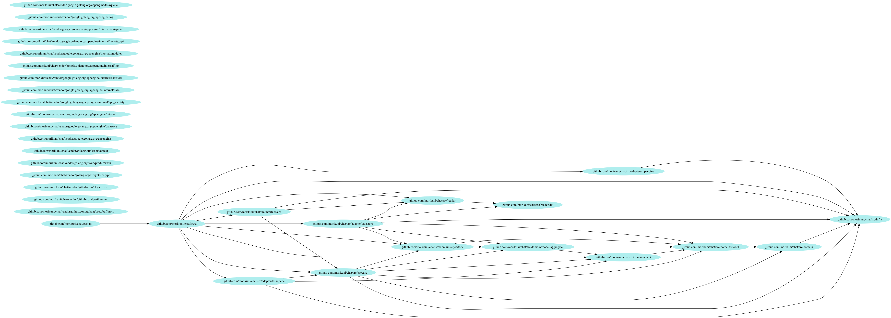

theme: Plain Jane, 3
autoscale: true

# [fit] GoにおけるDIパターン
### Go Friday 2017/11/10

---

# 自己紹介


- Name: 森國 泰平 (Morikuni Taihei)
- Twitter: [@inukirom](https://twitter.com/inukirom)
- GitHub: [@morikuni](https://github.com/morikuni)
- 所属: 株式会社メルカリ/ソウゾウ
    - メルカリ カウル
    - APIエンジニア

---

# DIしていますか？ 🙂

---

# Q. なぜDIするのか？
## A. ユニットテストをするため

---

# DIをするための2つの要素

---

## 1. 実装ではなくinterfaceに依存させる
## 2. interfaceに対し実装を注入する

---

# 実装ではなくinterfaceに依存させる

## ❌️ 直接関数を使う

```go
import (
    ...
    "github.com/morikuni/user"
)

func DoSomethingForUser(ctx context.Context, userID int) {
    // DBのプロセスを立てないとテストできない
    user := user.FindByID(ctx, userID)
    TuyoiProcess(user)
}
```

---

# 実装ではなくinterfaceに依存させる

## ⚠️ グローバル変数を使う

```go
import (
    ...
    "github.com/morikuni/user"
)

type UserRepository interface {
    FindByID(context.Context, int) user.User
}

var Repository UserRepository

func DoSomethingForUser(ctx context.Context, userID int) {
    user := Repository.FindByID(ctx, userID)
    TuyoiProcess(user)
}
```

---

## テスト時だけ実装を入れ替えられる！ 💪

---


# が

---


## 初期化を忘れるとにるぽ
## 並列テストが出来ない

---

# 実装ではなくinterfaceに依存させる

## ⭕️ structのフィールドに持たせる

```go
import (
    ...
    "github.com/morikuni/user"
)

type UserRepository interface {
    FindByID(context.Context, int) user.User
}

type TuyoiService struct {
    // テスト時だけ実装を入れ替えられる！
    // コンストラクタ経由などでインスタンス化すれば初期化が必ず行われる
    // テスト毎にインスタンスを作れば並列化可能
    Repository UserRepository
}

func (s TuyoiService) DoSomethingForUser(ctx context.Context, userID int) {
    user := s.Repository.FindByID(ctx, userID)
    TuyoiProcess(user)
}
```

---

## ✅️1. 実装ではなくinterfaceに依存させる
## 2. interfaceに対し実装を注入する

---

## ここまでの話はよくききますが

---

## ではどうやってstructのフィールドに
## 実装を注入するか？ 🤔

---

# interfaceに対し実装を注入する

## ❌️直接関数を使っている

```go
import (
    ...
    "github.com/morikuni/user"
)

func DoSomethingForUser(ctx context.Context, userID int) {
    // DBのプロセスを立てないとテストできない
    user := user.FindByID(ctx, userID)
    TuyoiProcess(user)
}

func API(w http.ResponseWriter, r *http.Request) {
    userID := r.FormValue("user_id")
    DoSomethingForUser(r.Context(), userID)
}

func main() {
    http.ListenAndServe(":80", API)
}
```

---

# interfaceに対し実装を注入する

## ⚠️mainでやる

```go
func main() {
    db, err := sql.Open("database", "dsn")
    if err != nil {
        panic("😢")
    }
    userRepository := NewUserRepository(db)
    tuyoiService := NewTuyoiService(userRepository)
    tuyoiAPI := NewTuyoiAPI(tuyoiAPI)

    http.ListenAndServe(":80", tuyoiAPI)
}
```

---

## mainが複雑になる 😢

---

# なぜmainが複雑になるのか

- mainが依存しているのは`http.Handler`のみ
- しかし`http.Handler`を作るには依存を注入しないといけない
- 依存を注入するためには各実装を手に入れる必要がある

---

## souzohしてみてください

---

## もし全ての実装が引数0個で手に入ったなら…

---

# interfaceに対し実装を注入する

## 引数0個の関数で依存を注入する

```go
func main() {
    tuyoiAPI := NewTuyoiAPI(
        NewTuyoiService(),
        NewHogeServivce(),
        ...
    )
    // tuyoiAPI := NewTuyoiAPI()

    http.ListenAndServe(":80", tuyoiAPI)
}
```

---

## 引数0個で実装を手にれるためには？

---

## 依存する実装が引数0で手に入ればいい

---

# DI専用のpackageを用意する

---

```go
func InjectAPI() TuyoiAPI {
    return NewTuyoiAPI(
        InjectTuyoiService(),
    )
}

func InjectTuyoiService() TuyoiService {
    return NewTuyoiService(
        InjectUserRepository(),
    )
}

func InjectUserRepository() UserRepository {
    return NewUserRepository(
        InjectDB(),
    )
}

func InjectDB() *sql.DB {
    db, err := sql.Open("database", "dsn")
    if err != nil {
        panic(":cry:")
    }
    return db
}

//----------- これより上がdi package

func main() {
    tuyoiAPI := InjectAPI()
    http.ListenAndServe(":80", tuyoiAPI)
}
```

---

## どこかで依存が増えても
## 修正はInject関数内のみ限定できる

---

## ✅️1. 実装ではなくinterfaceに依存させる
## ✅️2. interfaceに対し実装を注入する

---

## レイヤードアーキテクチャに適用する

### DI
### Interface
### Application
### Domain
### Infra

---

# Example
### [https://github.com/morikuni/chat](https://github.com/morikuni/chat) 

---

```
godepgraph -s -horizontal github.com/morikuni/chat/gae/api | dot -Tpng -o godepgraph.png
```



---

# DIしよ？ 😘

---

## 完。
