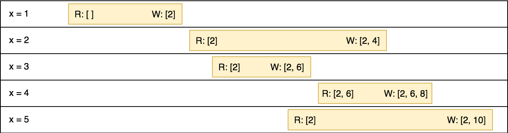
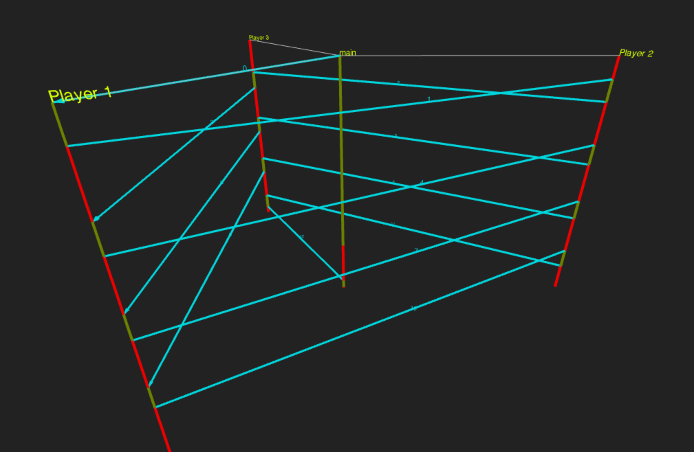
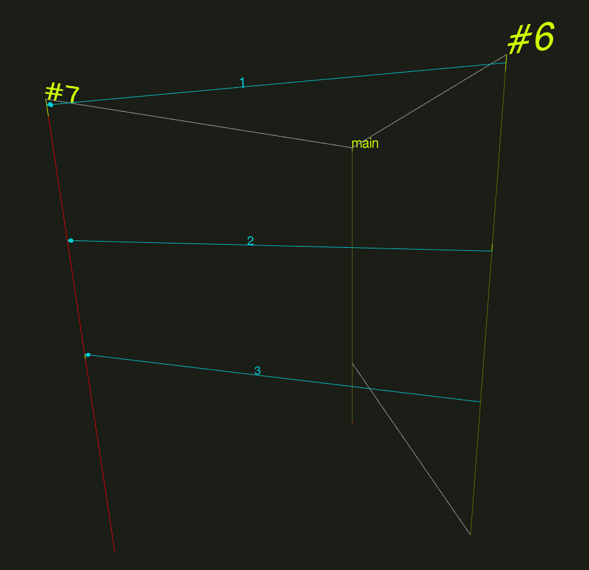

theme: morikuni_dark

# ホリネズミでもわかる
# goroutine入門
### golang.tokyo#14 2018/04/16

---

# 自己紹介


- Name: 森國 泰平 (Morikuni Taihei)
- GitHub: [@morikuni](https://github.com/morikuni)
- Twitter: [@inukirom](https://twitter.com/inukirom)
- 所属
    - 株式会社メルカリ
    - Goでバックエンド開発

---

### 本日の内容

初心者がgoroutineを使えるようになるための話

- Goにおける並行処理について
- goroutineを使った並行処理の注意点と対策
- 便利なツールの紹介

---

# Goにおける並行処理について

---

# Goに組み込まれている並行処理のための機能

- goroutine
- chan
- select

---

## goroutineについて

---

# goroutineとは

- Goを代表する機能の1つ
- 並行処理を行うための機能(CPUが複数あれば並列実行もできる)
- プロセスやスレッドよりも軽量
- main関数もgoroutineとして実行されている

---

# goroutineの起動

`go` をつけて関数を呼び出すことでgoroutineが起動する

```go
go Function()

go obj.Method()

go func() {
    fmt.Println("hello goroutine")
}()

go func(name string) {
    fmt.Println("hello "+name)
}("morikuni") // 引数も渡せる
```

---

# 実行順序は保証されない

```go
go func() {
    fmt.Println("goroutine 1")
}()
go func() {
    fmt.Println("goroutine 2")
}()
go func() {
    fmt.Println("goroutine 3")
}()

// goroutine 3
// goroutine 1
// goroutine 2
```

---

# goroutineとコールスタック

- goroutineが起動した時点で関数のコールスタックが分離する
- panicはgoroutineのコールスタックを戻っていく
- つまり、defer & recoverはpanicが発生したgoroutine内で使う必要がある
- Devquiz枠はこれがハマりポイント

---

# goroutineとコールスタック

goroutineを使わない場合のコールスタック

```go
func A() {
    B()
}

func B() {
    defer func(){}()
    C()
}

func C() {
    D()
}

func D() {
    panic("dead")
}
```

---

# goroutineとコールスタック

```go
func A() {
    func B() {
        defer func(){}()
        func C() {
            func D() {
                panic("dead")
            }
        }
    }
}
```

コールスタック: A → B → C → D

Bの`defer`が実行される

---

# goroutineとコールスタック

goroutineを使った場合のコールスタック

```go
func A() {
    B()
}

func B() {
    defer func(){}()
    go C() // goで呼び出す
}

func C() {
    D()
}

func D() {
    panic("dead")
}
```

---

# goroutineとコールスタック

```go
func A() {
    func B() {
        defer func(){}()
    }
}

func C() {
    func D() {
        panic("dead")
    }
}
```

コールスタック: C → D

Bの`defer`は実行されない

---

## chanについて

---

# chanとは

- goroutine間のデータの送受信や処理の同期を行う
- FIFOのキュー(最初に入れた値が最初に取り出される)
- 容量を持つ
- 3種類の型がある
    - Read Write
    - Read only
    - Write only

---

# chanの使い方

```go
// chanの作成
c := make(chan int)

// chanへの書き込み
c <- 1

// chanからの読み込み
x := <- c

for x := range c {
    ...
}

// chanを閉じる
close(c)
```

閉じたchanからはゼロ値が読み込めるようになり、forループが終了する
閉じたchanに書き込むとpanicする

---

# chanの型

```go
c := make(chan int) // RW chan

func Publish(c chan<- int) { // WO chan
    ...
}

func Subscribe(c <-chan int) { // RO chan
    ...
}

// RW chanはWOとROに代入可能
Publish(c)
Subscribe(c)
```

---

## selectについて

---

# selectとは

- 複数のchanへの操作を扱うためのもの
- 実行可能になったchanへの操作を1つだけ実行する
- defaultを書くことでchanのブロックを防げる

---

# selectの使い方

```go
select {
case v := <-c1:
    fmt.Println(v)
case c2 <- "hello":
}
```

c1からの読み込み or c2への書き込みのどちらかを実行する
実行できるまでブロックする

---

# selectの使い方

```go
select {
case v := <-c1:
    fmt.Println(v)
case c2 <- "hello":
default:
    fmt.Println("not ready")
}
```

c1からの読み込みもc2への書き込みもできない場合にdefaultが実行される

---

## ここまでがGoにおける並行処理の基礎

---

# goroutineを使った
# 並行処理の注意点と対策

---

## Wait処理

---

# Wait処理

```go
func main() {
    go func() {
        fmt.Println("Hello World")
    }()
}
```

なにが出力されるでしょう？

---

# Wait処理

```sh
$ go run main.go
(なにも出力されない)
```

なぜ？

---

# Wait処理

goroutineの処理が実行される前にプロセスが終了してしまうから

```go
func main() {
    go func() {
        fmt.Println("Hello World")
    }()
}
```

---

# Wait処理

対策1: Sleepする

```go
func main() {
    go func() {
        fmt.Println("Hello World")
    }()
    time.Sleep(time.Second)
}
```

処理が終わったのに待ち続けることになる
書き捨てのコードでよく使う

---

# Wait処理

対策2: channelを使う

```go
func main() {
    c := make(chan struct{})
    go func() {
        defer func() { c <- struct{}{} }()
        fmt.Println("Hello World")
    }()
    <-c // closeされるまで待つ
}
```

chanで処理の完了を通知する
`defer`で必ず実行されるようにする
`chan bool`を使うような例もあるけど、`struct{}`のほうが一般的

---

# Wait処理

対策3: sync.WaitGroupを使う

```go
func main() {
    var wg sync.WaitGroup
    wg.Add(1) // goroutineを呼び出す前にAddする
    go func() {
        defer wg.Done() // goroutineの中でdeferを使ってDoneを呼び出す
        fmt.Println("Hello World")
    }()
    wg.Wait()
}
```

`WaitGroup`は内部のカウンタが0になるまでwaitする
`Done() = Add(-1)`なので`Add`した数だけ`Done`する必要がある

---

# Wait処理のまとめ

- サンプルコードなどは`time.Sleep`が楽
- 基本的に`sync.WaitGroup`を使っていればいい
    - chanは複数のgoroutineの完了を待つのには使いづらい
- `golang.org/x/sync/errgroup`という`WaitGroup`にエラー処理を追加したものもある

---

## goroutineとforループ

---

# goroutineとforループ

1, 2, 3, 4, 5を出力したい(順不同)

```go
xs := []int{1, 2, 3, 4, 5}
for _, x := range xs {
    go func() {
        fmt.Println(x)
    }()
}
time.Sleep(time.Second)
```

なにが出力されるでしょう？

---

# goroutineとforループ

```sh
$ go run main.go
5
5
5
5
5
```

なぜ？

---

# goroutineとforループ

`x`はループ毎に値を上書きされて使い回されるから

```go
xs := []int{1, 2, 3, 4, 5}
for _, x := range xs {
    go func() {
        fmt.Println(x)
    }()
}
time.Sleep(time.Second)
```

---

# goroutineとforループ

forの実装イメージ

```go
func iterate(xs []int, x *int) func() {
	i := -1
	return func() {
		i++
		*x = xs[i]
	}
}

xs := []int{1, 2, 3, 4, 5}
var x int
next := iterator(xs, &x)
for i := 0; i < len(xs); i++ {
    next()
    go func() {
        fmt.Println(x)
    }()
}
```

---

# goroutineとforループ

対策: 一度変数に代入する

```go
for _, x := range xs {
    go func(x int) { // 関数の引数でうけとる
        fmt.Println(x)
    }(x)
}

for _, x := range xs {
    x := x // 別の変数に代入する
    go func() {
        fmt.Println(x)
    }()
}
```

---

## 競合状態

---

# 競合状態

xsの値を2倍してdoubleに書き込みたい(順不同)

```go
xs := []int{1, 2, 3, 4, 5}
var double []int
for _, x := range xs {
    go func(x int) {
        double = append(double, x*2)
    }(x)
}
time.Sleep(time.Second)
fmt.Println(double)
```

なにが出力されるでしょう？

---

# 競合状態

```sh
$ go run main.go
[2 10]

$ go run main.go
[4 2 6 8 10]

$ go run main.go
[4 2 8]
```

なぜ？

---

# 競合状態

doubleを読み込んで、書き込むまでにdoubleが更新されているから

```go
for _, x := range xs {
    go func(x int) {
        double = append(double, x*2)
    }(x)
}
```

実際には読み込みから書き込みまでに時間がかかっている

```go
for _, x := range xs {
    go func(x int) {
        tmp := double
        tmp = append(tmp, x*2)
        double = tmp
    }(x)
}
```

---

# 競合状態

R: doubleから読み込んだ値
W: doubleに書き込む値



---

# 競合状態

対策1: 直接で処理する

- 並行処理をすると競合がおきるので、排他制御を行う
- 排他制御を一番簡単にやる方法は、直列で処理することなので本当にgoroutine使う必要があるかを検討してみるといい

---

# 競合状態

対策2: sync.Mutexを使う

```go
var mu sync.Mutex
xs := []int{1, 2, 3, 4, 5}
for _, x := range xs {
    go func(x int) {
        mu.Lock()
        defer mu.Unlock()
        double = append(double, x*2)
    }(x)
}
```

一度に`mu.Lock()`できるのは1箇所だけ
他の箇所は`mu.Unlock()`されるまでブロックされる
`sync.RWMutex`を使うと、読み込みと書き込みのLockを分けて読み込みは並行で行える

---

# 競合状態

主に数値系: sync/atomicパッケージを使う

```go
var count int64
atomic.AddInt64(&count, 1) // countに1を足す
atomic.CompareAndSwapInt64(&count, 1, 10) // countの値が1なら10にする
v := atomic.LoadInt64(&count) // countの値を読み込む
atomic.StoreInt64(&count, 100) // countの値を100にする
```

`float64`などはサポートされていないが頑張れば使える
(floatを内部的にはuintとして扱い、`math.Float64frombits`と`atomic.LoadUint64`などを組み合わせる)

---

# 競合状態のまとめ

- 直列処理(goroutineつかわない)ではダメか検討
- 数値系はsync/atomicが使える可能性がある
- それ以外はsync.Mutex, sync.RWMutexを使えば大体問題ない

---

# goroutine leak

---

# goroutine leak

websiteAとwebsiteBのどちらかの結果を出力したい

```go
type result struct {
	Response *http.Response
	Err      error
}

func fetch(url string, c chan<- result) {
	res, err := http.Get(url)
	c <- result{res, err}
}

ch := make(chan result)
go fetch("https://websiteA", ch)
go fetch("https://websiteB", ch)
fmt.Println(<-ch) // 最初に返ってきた方だけを使う
```

なにが問題になるでしょう？

---

# goroutine leak

```go
type result struct {
	Response *http.Response
	Err      error
}

func fetch(url string, c chan<- result) {
	res, err := http.Get(url)
	c <- result{res, err}
}

ch := make(chan result)
go fetch("https://websiteA", ch)
go fetch("https://websiteB", ch)
fmt.Println(<-ch) // 最初に返ってきた方だけを使う
```

websiteAとwebsiteBのどちらか片方のgoroutineがleakする

---

# goroutine leak

対策: context.Contextとselectを使う

```go
func fetch(ctx context.Context, url string, result chan<- *http.Response) {
	res, err := http.Get(url) // ほんとはGetもcontextを使った方がいいけど例なので割愛
    select {
	case c <- result{res, err}
    case <-ctx.Done(): // contextが完了していたら処理をやめる
    }
}

ctx, cancel := context.WithCancel(context.Background())
defer cancel() // 完了後にcancelしてcontextをdone状態にする
ch := make(chan *http.Response)
go fetch(ctx, "https://websiteA", ch)
go fetch(ctx, "https://websiteB", ch)
fmt.Println(<-ch) // 最初に返ってきた方だけを使う
```

websiteAが完了 → `fmt.Println` → `defer cancel()` →
`ctx.Done()` → websiteBの`fetch`が終了 → goroutineが終了

---

## goroutineを使った並行処理の注意点と対策のまとめ

- forでは変数に代入する
- sync.WaitGroupで完了を待つ
- sync.Mutexで排他制御をする
- 数値系はsync/atomicが便利
- context.Contextでgoroutine leakを回避する

---

# 便利なツールの紹介

---

# gotrace

- [https://github.com/divan/gotrace](https://github.com/divan/gotrace)
- goroutineとchanのやりとりを可視化できる



---

# gotraceの使い方

gotraceコマンドをインストールする
たぶんmasterブランチだと動かない

```sh
$ go get -u https://github.com/divan/gotrace
$ cd $(GOPATH)/github.com/divan/gotrace
$ git checkout -b go18 origin/go18
$ go install
```

---

# gotraceの使い方

可視化したい関数の先頭にこれを書く

```go
import "runtime/trace"

f, err := os.Create("trace.out")
if err != nil {
    log.Fatal(err)
}
defer f.Close()
trace.Start(f)
defer trace.Stop()
```

---

# gotraceの使い方

gotraceで可視化する
パッチを当てたGoを使う必要があるのでdockerを使う

```sh
$ cd path/to/main  # main.goがあるディレクトリ
$ docker run --rm -it \
    -e GOOS=darwin \
    -v (pwd):/src \
    divan/golang:gotrace \
    go build -o /src/binary /src/main.go
$ ./binary
$ gotrace ./trace.out
```

---

### gotraceを動かしてみる

```go
func Publish(c chan<- int) {
	c <- 1
	time.Sleep(time.Millisecond)
	c <- 2
	time.Sleep(time.Millisecond)
	c <- 3
	time.Sleep(time.Millisecond)
}

func Subscribe(c <-chan int) {
	for v := range c {
		fmt.Println(v)
	}
}

func main() {
	f, err := os.Create("trace.out")
	if err != nil {
		log.Fatal(err)
	}
	defer f.Close()
	trace.Start(f)
	defer trace.Stop()

	c := make(chan int, 0)
	go Publish(c)
	go Subscribe(c)
	time.Sleep(5 * time.Millisecond)
}
```

---

# gotraceを動かしてみる



---

## goroutine leakとか見つかるかも?

---

# 今日のまとめ

- Goは言語的に並行処理をサポートしている
- 並行処理は難しいけどある程度パターン化できる
- sync系パッケージ便利
- gotraceは楽しい(小並感)

---

# ʕ◔ϖ◔ʔ < goroutineやっていき
